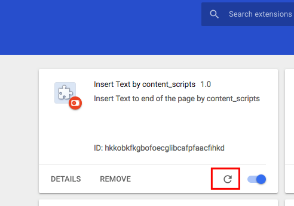

Chrome Extension
================

A simple extension use `content_scripts` to modify page content.

Install:
--------

Chrome -> `Extensions` -> Enable `Developer Mode` -> `Load unpacked` -> select the root directory of this project.

After installing, now when you open any page, there will be a line of text inserted to the page end.

In order to see it clearly, you can use the projected `test.html`:

```
npm install -g http-server
http-server .
```

Then open <http://localhost:8080/public/test.html> to view the result.

Reload extension when developing
--------------------------------

`content_scripts` of chrome extension won't automatically reloaded when code is modified, we have to refresh it manually:

Chrome -> `Extesions` -> Find the extension -> Click on the `Reload` icon.

